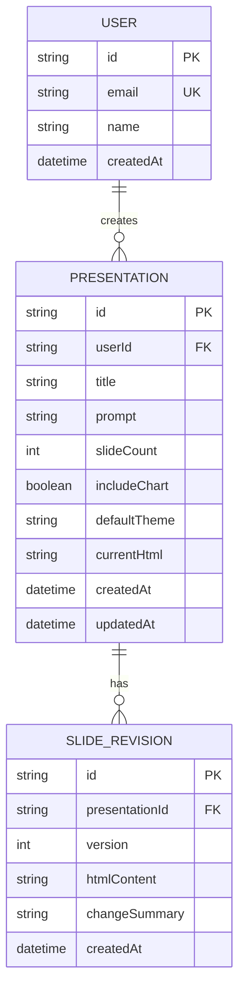

# 데이터 스키마 및 저장소 설계 (Data Schema & Storage Design)

## 개요
Gemini Slide Studio는 MVP 단계에서 사용자 편의와 무설정 즉시 실행을 위해 **브라우저 로컬 저장소(LocalStorage)**를 1차 영속 계층으로 사용하며, 향후 다중 사용자 및 클라우드 동기화를 위한 **Prisma / SQLite (또는 PostgreSQL)** 확장 스키마를 함께 정의합니다.

---

## 1. 클라이언트 영속 모델 (LocalStorage Schema)

키 명칭: `gemini_slide_studio_history_v1`
저장 형태: JSON 문자열 (배열 형태)

### PresentationRecord 인터페이스
```typescript
interface PresentationRecord {
  id: string;             // UUID 또는 timestamp 기반 고유 식별자 (예: "deck_1726315200000")
  title: string;          // 슬라이드 주제 / 프레젠테이션 제목
  prompt: string;         // 생성 시 입력했던 원본 기획안 텍스트
  slideCount: number;     // 슬라이드 페이지 수
  includeChart: boolean;  // 차트 포함 여부
  theme: 'dark' | 'light';// 기본 테마
  html: string;           // 생성된 순수 실행형 HTML5 전문
  createdAt: string;      // ISO 8601 생성 일시
  updatedAt: string;      // ISO 8601 최종 수정 일시
}
```

---

## 2. 서버 영속 모델 (향후 확장 DB 스키마 - Prisma / SQL)



### 테이블 정의

#### `presentations`
| 컬럼 | 타입 | 제약조건 | 설명 |
|------|------|---------|------|
| `id` | VARCHAR(36) | PRIMARY KEY | 프레젠테이션 고유 식별자 |
| `userId` | VARCHAR(36) | NULLABLE | 생성 사용자 ID (게스트인 경우 NULL) |
| `title` | VARCHAR(255) | NOT NULL | 슬라이드 대표 제목 |
| `prompt` | TEXT | NOT NULL | 사용자 입력 기획 텍스트 |
| `slideCount` | INT | NOT NULL DEFAULT 5 | 슬라이드 페이지 수 |
| `includeChart`| BOOLEAN | NOT NULL DEFAULT TRUE | 차트 포함 여부 |
| `defaultTheme`| VARCHAR(10) | NOT NULL DEFAULT 'dark' | 시작 테마 |
| `currentHtml` | LONGTEXT | NOT NULL | 단독 실행형 HTML5 소스 코드 |
| `createdAt` | DATETIME | NOT NULL DEFAULT NOW() | 생성 일시 |
| `updatedAt` | DATETIME | NOT NULL DEFAULT NOW() | 수정 일시 |

#### `slide_revisions`
| 컬럼 | 타입 | 제약조건 | 설명 |
|------|------|---------|------|
| `id` | VARCHAR(36) | PRIMARY KEY | 리비전 ID |
| `presentationId`| VARCHAR(36) | FOREIGN KEY | 대상 프레젠테이션 ID |
| `version` | INT | NOT NULL | 리비전 버전 번호 |
| `htmlContent` | LONGTEXT | NOT NULL | 해당 시점의 HTML 코드 |
| `changeSummary` | VARCHAR(255) | NULLABLE | 변경 내역 요약 |
| `createdAt` | DATETIME | NOT NULL DEFAULT NOW() | 생성 일시 |

### 인덱스 전략
| 테이블 | 인덱스명 | 컬럼 | 용도 |
|--------|---------|------|------|
| `presentations` | `idx_presentations_user_created` | `(userId, createdAt DESC)` | 사용자별 최신 프레젠테이션 목록 조회 |
| `slide_revisions` | `idx_revisions_presentation_ver` | `(presentationId, version DESC)` | 버전별 히스토리 복원 조회 |
